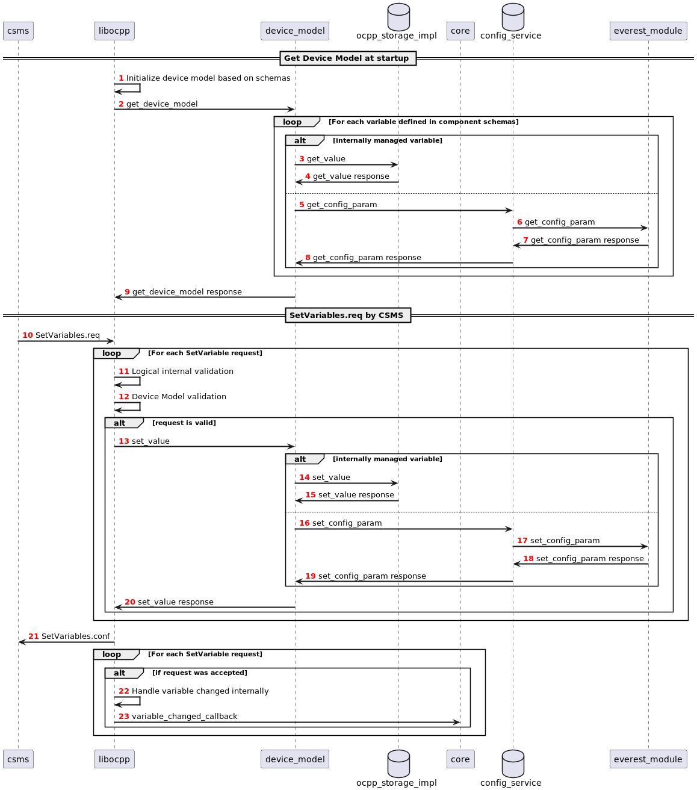
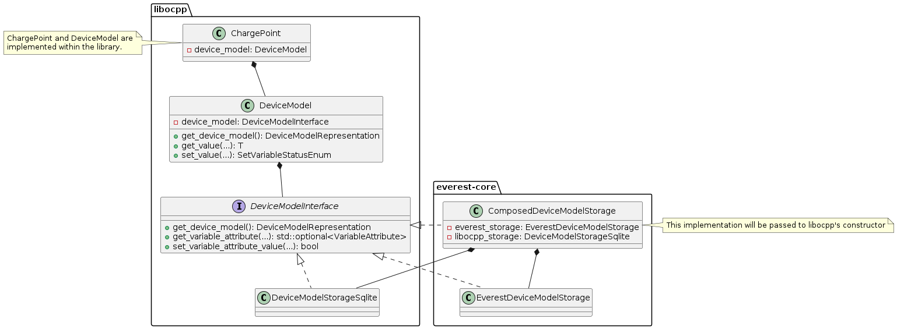

=============
Global Errors
=============

The `enable_global_errors` flag for this module is enabled. This module is therefore able to retrieve and process all
reported errors from other modules loaded in the same EVerest configuration.

=====================================
Device model storage / config service
=====================================

The device model holds configuration and values that are managed by libocpp or externally, by other EVerest modules. To
be able to get the externally managed configuration, a config service is defined.
The config service is yet to be defined and implemented, but the first steps are already made.

----------------------------------
Requirements of the config service
----------------------------------

* Config refactor --> Modules get their config via MQTT as JSON
* Responsible for read and write operations of configuration parameters of EVerest modules at runtime and startup
* Config service to be accessed by priviliged modules (e.g. OCPP) using an option in the manifest.yaml like
  enable_config_service
* Config service needs to notify priviliged modules (e.g. OCPP) if a variable has changed (e.g. internally or by some
  other module/UI etc.)
* Config handler shall be part of modules with R/W config parameters (extend ev-cli module generation for this)
* Module config parameter definition needs to be extended by mutability option (RW, RO, WO) in manifest.yaml

This is how the config_service may be used within priviliged modules:

.. highlight:: C++
   this->config_service->set_config_param(module_id, optional<implementation_name>, config_name, value);

This is how modules may use the config service to change their internal configuration themselves:

.. highlight:: C++
   this->config.set_param(config_name, value)

---------------------------------------------------------------
Internally and Externally Managed Variables of the Device Model
---------------------------------------------------------------

As mentioned in the introduction the device model of OCPP2.0.1 can contain various physical or logical components and
variables. While in OCPP1.6 almost all of the standardized configuration keys are used to influence the control flow of
libocpp, in OCPP2.0.1 the configuration and telemtry variables that can be part of the device model go beyond the
control or reporting capabilities of only libocpp. Still there is a large share of standardized variables in OCPP2.0.1
that do influence the control flow of libocpp. Therefore it is requirement to make a distinction between externally and
internally managed variables of the device model inside the device model implementation:

* Internally managed variables: Internally managed variables influence the control flow or can be reported by libocpp
  and are therefore owned by libocpp. If the mutability of such a variable is ReadWrite, the CSMS or the consumer of
  libocpp can set its value and the OCPP201 module is responsible for updating this value in the device model.
  Examples: HeartbeatInterval, AuthorizeRemoteStart, SampledDataTxEndedMeasurands, AuthCacheStorage
* Externally managed variables: These variables do not influence the control flow of libocpp.
  Examples: ConnectionTimeout, MasterPassGroupId

---------------------------------------------------------------------------
Sequence of variable access for internally and externally managed variables
---------------------------------------------------------------------------

--------------
OCPP201 module
--------------
* Provide external implementation of device model API
* Implement device_model_interface.hpp as part of OCPP201 module
* Device model implementation must differentiate between internally and externally managed variables

  * Internally Managed: Owned, stored and accessed in libocpp in device model storage
  * Externally Managed: Owned, stored and accessed via EVerest config service
  * For externally managed variables a mapping to the EVerest configuration parameter needs to be defined

* Property for internally or externally managed for each variable in the component schemas: The component config has
  a `source` member defined of `Variable`. If `source` is `OCPP`, it means this is an internally managed variable. If
  nothing is defined, this also means it is an internally managed variable.
* This design allows for singe source of truth --> OCPP is source for internally managed variables and config service
  for externally managed configuration variables
* To be done: A mapping mechanism from component schema variables to EVerest config paramaters and vice versa

------------------------------
Class diagram for device model
------------------------------

Clarification of the device model classes of this diagram:

* DeviceModel:

  * Part of libocpp
  * Contains device model representation and business logic to prevalidate requests to the storage
  * Contains reference to device model interface implementation

* DeviceModelInterface:

  * Pure virtual class of libocpp
  * Defines contract for storage implementations

* LibocppDeviceModelStorage

  * Implements DeviceModelInterface as part of libocpp
  * Represents existing SQLite implementation of device model

* EverestDeviceModelStorage

  * Implements DeviceModelInterface as part of everest-core (OCPP201 module)
  * Uses config service to interact with EVerest modules

* ComposedDeviceModelStorage

  * (Final) implementation of DeviceModelInterface as part of everest-core (OCPP201 module)
  * A reference of this class will be passed to libocpp's ChargePoint constructor
  * Differentiates between externally and internally managed variables
