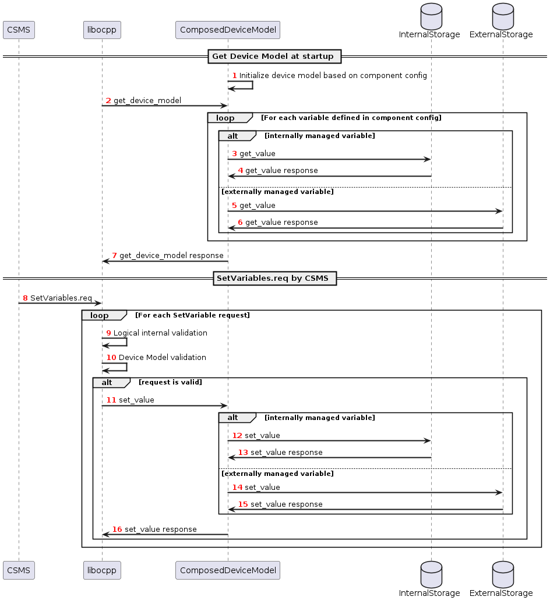

=============
Global Errors
=============

The `enable_global_errors` flag for this module is enabled. This module is therefore able to retrieve and process all
reported errors from other modules loaded in the same EVerest configuration.

============
Device model
============

For managing configuration and telemtry data of a charging station, the OCPP2.0.1 specification introduces
a device model that is very different to the design of OCPP1.6. 
The specified device model comes with these high-level requirements:

* 3-tier model: Break charging station down into 3 main tiers: ChargingStation, EVSE and Connector
* Components and Variables: Break down charging station into components and variables for configuration and telemetry
* Complex data structure for reporting and configuration of variables
* Device model contains variables of the whole charging station, beyond OCPP business logic

The device model holds configuration and values that are managed by libocpp or externally, by other EVerest modules. 
Externally managed variables can be retrieved using the EVerest configuration service.
The config service is yet to be defined and implemented, so for now all variables are treated as internal variables.

---------------------------------------------------------------
Internally and Externally Managed Variables of the Device Model
---------------------------------------------------------------

The device model of OCPP2.0.1 can contain various physical or logical components and
variables. While in OCPP1.6 almost all of the standardized configuration keys are used to influence the control flow of
libocpp, in OCPP2.0.1 the configuration and telemetry variables that can be part of the device model go beyond the
control or reporting capabilities of only libocpp. Still there is a large share of standardized variables in OCPP2.0.1
that do influence the control flow of libocpp. Therefore it is a requirement to make a distinction between externally and
internally managed variables of the device model inside the device model implementation:

* Internally managed variables: Internally managed variables influence the control flow or can be reported by libocpp
  and are therefore owned by libocpp. If the mutability of such a variable is ReadWrite, the CSMS or the consumer of
  libocpp can set its value and the OCPP201 module is responsible for updating this value in the device model.
  Examples: HeartbeatInterval, AuthorizeRemoteStart, SampledDataTxEndedMeasurands, AuthCacheStorage
* Externally managed variables: These variables do not influence the control flow of libocpp. These are owned and 
  managed by other EVerest modules. 
  Examples: ConnectionTimeout, MasterPassGroupId

---------------------------------------------------------------------------
Sequence of variable access for internally and externally managed variables
---------------------------------------------------------------------------

--------------
OCPP201 module
--------------
* Provides an implementation of device model API defined as part of libocpp (implements device_model_interface.hpp)
* Device model implementation must differentiate between internally and externally managed variables

  * Internally Managed: Owned, stored and accessed in libocpp in device model storage
  * Externally Managed: Owned, stored and accessed via EVerest config service
  * For externally managed variables a mapping to the EVerest configuration parameter needs to be defined

* Property for internally or externally managed for each variable in the component schemas: The component config has
  a `source` member defined of `Variable`. If `source` is `OCPP`, it means this is an internally managed variable. If
  nothing is defined, this also means it is an internally managed variable.
* This design allows for singe source of truth --> OCPP is source for internally managed variables and config service
  for externally managed configuration variables
* To be done: A mapping mechanism from component schema variables to EVerest config paramaters and vice versa

------------------------------
Class diagram for device model
------------------------------

Clarification of the device model classes of this diagram:

* DeviceModel:

  * Part of libocpp
  * Contains device model representation and business logic to prevalidate requests to the device model variables
  * Contains reference to device model interface implementation

* DeviceModelInterface:

  * Pure virtual class of libocpp
  * Defines contract for device model implementations

* DeviceModelStorageSqlite

  * Implements DeviceModelInterface as part of libocpp
  * This storage holds internally managed variables

* EverestDeviceModelStorage

  * Implements DeviceModelInterface as part of everest-core (OCPP201 module)
  * Uses EVerest config service to retrieve configuration variables of EVerest modules

* ComposedDeviceModelStorage

  * (Final) implementation of DeviceModelInterface as part of everest-core (OCPP201 module)
  * A reference of this class will be passed to libocpp's ChargePoint constructor
  * Differentiates between externally and internally managed variables
